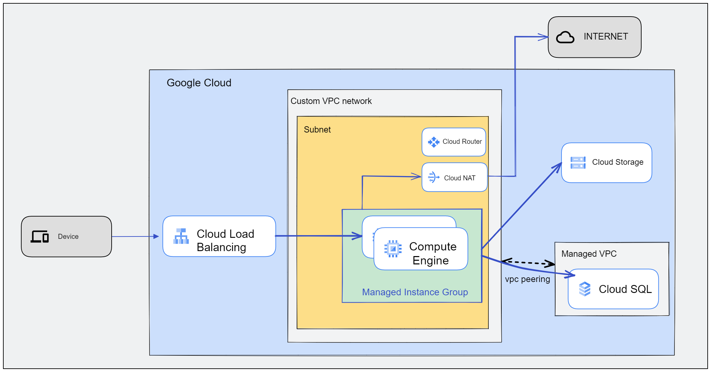

# GCP_Terraform Basic 
GCP에서 Terraform을 배우기 위한 기본 과정입니다.

각 폴더에는 폴더 이름에 해당하는 과정을 진행합니다.

## 실습 준비
---
- GCP 계정이 필요합니다.
- GCP 프로젝트가 필요합니다.
- GCP Cloud Shell을 사용합니다.
- GCP Cloud Shell을 사용하지 않고 싶다면 다음과 같은 환경이 필요합니다.
    - gcloud cli가 설치되어 있어야 합니다.
    - terraform version 1.3.7 
- gcloud auth application-default login 명령어를 통해 인증을 진행합니다.
- 각 폴더 terraform.tfvars 파일을 생성하고 아래 변수를 추가합니다.
    - project_id      = [GCP Project ID]
    - vpc_name        = [VPC 이름]
    - subnetwork_name = [Subnet 이름]
        ```
        $ cat terraform.tfvars
        project_id      = [GCP Project ID]
        vpc_name        = [VPC 이름]
        subnetwork_name = [Subnet 이름]
        ```
## 목표
---
GCP에서 Web서비스를 위한 기본적인 인프라 환경을 구성합니다. 

## 구성도
---


## GCP에서 생성하는 리소스는 다음과 같습니다. 
---
- vpc
- subnet
- firewall
- instence_template
- instance_group
- load_balancer
- health_check
- storage
- cloud_sql