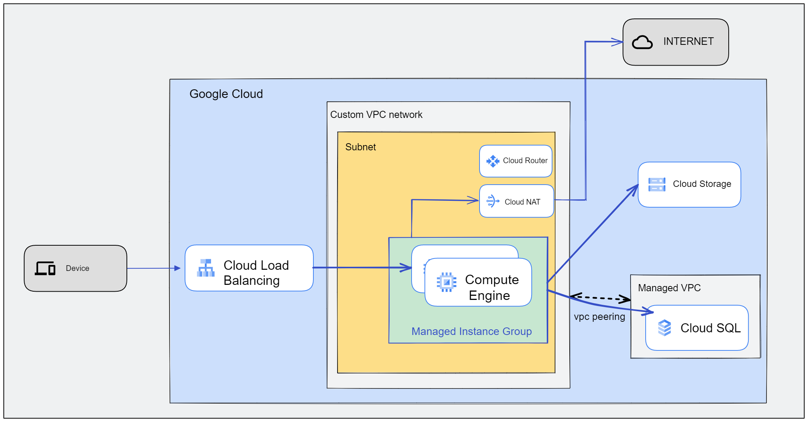

# Web Service on GCP
GCP에서 Terraform을 배우기 위한 기본 과정입니다.

modules폴더 안의 리소스 이름에 해당하는 과정을 진행합니다.

## 실습 준비
---
- GCP 계정이 필요합니다.
- GCP 프로젝트가 필요합니다.
- GCP Cloud Shell을 사용합니다.
    - Cloud shell에는 Terraform 1.3.7이 설치되어 있습니다.
- GCP Cloud Shell을 사용하지 않고 싶다면 다음과 같은 환경이 필요합니다.
    - [gcloud cli](https://cloud.google.com/sdk/docs/install?hl=ko)
         가 설치되어 있어야 합니다.
    - [terraform version >= 1.3.7](https://www.terraform.io/downloads.html) 
- `gcloud auth application-default login` 명령어를 통해 인증을 진행합니다.

## 목표
---
GCP에서 Web서비스를 위한 기본적인 인프라 환경을 구성합니다. 

## 구성도
---

## 실행 방법
---
1. 실습하고자 하는 폴더 이동
2. `terraform init` 명령어를 통해 초기화를 진행합니다.
3. `terraform.tfvars` 파일을 생성합니다.
4. `terraform.tfvars` 파일에 아래 변수를 추가합니다.
    - project_id      = [GCP Project ID]
    - vpc_name        = [VPC 이름]
    - subnetwork_name = [Subnet 이름]
5. `terraform plan` 명령어를 통해 실행 계획을 확인합니다.
6. `terraform apply` 명령어를 통해 실행합니다.
7. `terraform destroy` 명령어를 통해 삭제합니다.

## GCP에서 생성하는 리소스는 다음과 같습니다. 
---
- [vpc](https://cloud.google.com/vpc/docs/vpc?hl=ko)
- [subnet](https://cloud.google.com/vpc/docs/vpc?hl=ko)
- [CloudNat](https://cloud.google.com/nat/docs/overview?hl=ko)
- [router](https://cloud.google.com/router/docs/overview?hl=ko)
- [firewall](https://cloud.google.com/vpc/docs/firewalls?hl=ko)
- [instance_template](https://cloud.google.com/compute/docs/instance-templates?hl=ko)
- [instance_group](https://cloud.google.com/compute/docs/instance-groups?hl=ko)
- [load_balancer](https://cloud.google.com/load-balancing/docs/https?hl=ko)
- [health_check](https://cloud.google.com/load-balancing/docs/health-checks?hl=ko)
- [cloud_sql](https://cloud.google.com/sql/docs/mysql?hl=ko) 
- [cloud_stroage](https://cloud.google.com/storage/docs/creating-buckets?hl=ko)